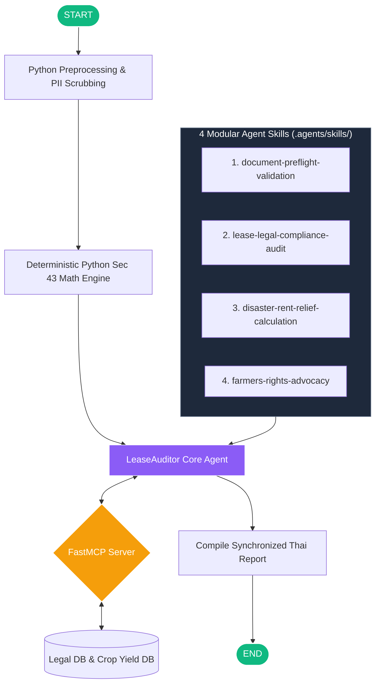

# 📝 ข้อมูลสำหรับกรอกฟอร์ม Kaggle Capstone Project Submission (ฉบับอัปเดตล่าสุด)

เอกสารนี้รวบรวมข้อมูลอัปเดตล่าสุดของโครงการ **ThaiAgriLease** ตรงตามช่องกรอกข้อมูลในรูปภาพฟอร์ม Kaggle โดยจัดทำ **เนื้อหาภาษาอังกฤษ (สำหรับคัดลอกลงฟอร์ม)** ควบคู่กับ **คำอธิบายภาษาไทย (สำหรับผู้ใช้อ่าน)** ปรับแต่งรูปแบบให้แสดงผลใน Obsidian ได้สวยงามสมบูรณ์ ไม่เพี้ยนครับ

---

## 📌 1. Basic details (ข้อมูลเบื้องต้น)

### 🏷️ TITLE * (กรอกในช่อง TITLE - จำกัด 80 ตัวอักษร)
> 💡 **คำอธิบายภาษาไทย**: ชื่อโครงการภาษาอังกฤษแบบกระชับ ชัดเจน ระบุระบบเอเจนต์และการปกป้องสิทธิ์ชาวนา

```text
ThaiAgriLease: Ultra-Fast AI Legal Auditor for Thai Tenant Farmers
```

---

### 📝 SUBTITLE (กรอกในช่อง SUBTITLE - จำกัด 140 ตัวอักษร)
> 💡 **คำอธิบายภาษาไทย**: สรุปจุดเด่นของโครงการใน 1 ประโยค เน้นการป้องกันสัญญาเช่าผิดกฎหมาย คำนวณภัยพิบัติ และการทำงานที่รวดเร็วด้วย ADK 2.0

```text
Protecting Thai tenant farmers from illegal leases and climate disasters using high-speed ADK 2.0 multi-agents and FastMCP.
```

---

### 🖼️ Card and Thumbnail Image (ภาพหน้าปกผลงาน - แนะนำขนาด 560 × 280)
> 💡 **คำอธิบายภาษาไทย**: ไฟล์ภาพหน้าปกสำหรับคลิกปุ่ม "Edit image" อัปโหลดขึ้นระบบ

* **ไฟล์ภาพสำหรับอัปโหลด**: อัปโหลดรูปภาพหน้าปกโครงการ หรือรูปภาพหน้าจอเว็บภาษาไทย

---

## 🏆 2. Submission Tracks * (หมวดหมู่การแข่งขัน)

> 💡 **คำอธิบายภาษาไทย**: คลิกปุ่ม "Select Track" แล้วเลือกหมวดหมู่นี้

* **Track ที่ต้องเลือก**: `Agents for Good`

---

## 📁 3. Media gallery (คลังสื่อประกอบโครงการ)

> 💡 **คำอธิบายภาษาไทย**: คลิกปุ่ม "Add videos or photos" เพื่ออัปโหลดรูปภาพและใส่ลิงก์วิดีโอสาธิตการใช้งาน

1. **ภาพหน้าปกและรูปแคปหน้าจอแอปพลิเคชัน**: อัปโหลดไฟล์รูปภาพหน้าปกโครงการ หรือรูปภาพหน้าจอเว็บภาษาไทย
2. **วิดีโอสาธิต (YouTube Video)**: แนบลิงก์วิดีโอ YouTube สาธิตการใช้งานแอปพลิเคชัน (ความยาวไม่เกิน 5 นาที)

---

## 📝 4. Project Description (รายละเอียดโครงการ)

> 💡 **คำอธิบายภาษาไทย**: คัดลอกเนื้อหาภาษาอังกฤษตั้งแต่หัวข้อ **# Kaggle Capstone Project Writeup: ThaiAgriLease 🌾** ด้านล่างนี้ทั้งหมด นำไปวางในกล่องข้อความใหญ่ช่อง **Project Description** ในระบบ Kaggle (ความยาวรวมไม่เกิน 2,500 คำ)

---

# Kaggle Capstone Project Writeup: ThaiAgriLease 🌾

**Competition Track**: Agents for Good  
**Project Name**: ThaiAgriLease: High-Speed Multi-Agent Legal Auditor, Disaster Relief Calculator, and Proactive Advocate for Thai Farmers  
**Submission Language**: English  

---

## 🏆 SECTION 1: Abstract & Project Pitch

### The Social Pain Point
Agriculture is the foundation of Thailand's economy, employing over 30% of the national workforce. However, land ownership is heavily concentrated, forcing nearly 30% of farming households (and over 40% in major rice-producing provinces) to lease land. Due to legal illiteracy, lack of affordable legal representation, and systemic information asymmetry, underprivileged farmers frequently sign land lease contracts (สัญญาเช่าที่นา) that directly violate the **Thai Agricultural Land Lease Act B.E. 2524**.

Major legal violations include:
1. **Illegal Short Durations (Section 26)**: Landlords impose short 1- or 2-year leases, whereas the law mandates a **6-year legal minimum** to guarantee tenant farming stability.
2. **Loss of Inheritance Rights (Section 27)**: Clauses terminating the lease immediately upon the tenant's death, violating Section 27 which dictates that leasehold rights automatically inherit to legal heirs.
3. **Exploitative Evictions (Section 46)**: Clauses allowing immediate eviction for a 30-day rent default, whereas Section 46 mandates **2 full consecutive years of rent default** before eviction is legal.
4. **Denial of Disaster Relief (Section 43)**: Landlords charging full rent despite severe climate disasters, ignoring Section 43 which mandates proportional rent reductions or 100% waivers based on yield damage.

### The Solution: ThaiAgriLease
**ThaiAgriLease** is a production-grade, ultra-fast AI multi-agent system built with **Google Agent Development Kit (ADK 2.0)** and **FastMCP (Model Context Protocol)**. Tailored specifically for Thai farmers with a 100% Thai web interface, it enables farmers to upload contracts (PDF/images/text) and input disaster parameters. The system instantly audits legal compliance, calculates statutory disaster rent reductions, and drafts ready-to-sign formal advocacy notice letters for landlords or local arbitration committees.

---

## 🏗️ SECTION 2: Technical Solution & High-Speed Multi-Agent Architecture

### 1. Synchronized Single-Pass Workflow & Speed Optimization
To solve common multi-agent pitfalls—such as excessive execution latency and contradictory output summaries—we re-engineered the workflow architecture:
- **Deterministic Python Pre-Computation**: Section 43 mathematical formulas (crop loss damage ratio, statutory reduction percentage, and net rent due) and regional average yield lookups are computed in Python during workflow preprocessing.
- **Single-Pass Unified AI Audit**: By supplying pre-computed disaster results and FastMCP legal references into a unified `LeaseAuditor` agent, we streamlined inference from sequential LLM hops down to **1 single pass**. This dramatically reduces overall audit latency while improving accuracy.
- **Zero-Contradiction Engine**: Ensured 100% synchronization between the executive binary status badge (`✅ Correct/Legal` vs `❌ Illegal/Unfair`) and every individual row in the Legal Compliance Evaluation Summary Table.



### 2. Full Legal Scope & Proactive Tenant Advocacy
The system covers the complete protection spectrum under Act B.E. 2524:
- **Section 26 (Minimum Duration)**: Enforces the 6-year legal minimum lease term.
- **Section 27 (Inheritance Rights)**: Protects automatic leasehold transfer to heirs upon tenant death.
- **Section 46 (Eviction Protection)**: Protects against eviction unless rent is unpaid for 2 full consecutive years.
- **Section 43 (Disaster Relief)**: Grants proportional rent reductions (>25% crop loss) or a 100% full rent waiver (>66.66% crop loss).
- **Section 53 (First Refusal Rights)**: Requires landlords to offer 30-day written right of first refusal before selling land.
- **Section 36 (Soil Improvement Compensation)**: Guarantees compensation for tenant property and soil improvements upon lease termination.

### 3. FastMCP Server Integration (`mcp_server.py`)
Instead of embedding entire legal codices into prompts, `mcp_server.py` exposes read-only tool routes (`get_legal_clauses`) to query structured JSON databases. This progressive disclosure eliminates legal hallucination while maintaining strict token efficiency.

### 4. Enterprise Uptime Resilience (3-Model Fallback Engine)
We implemented a custom `FallbackGemini` client in `app/model_client.py`. Upon encountering API rate limits (Error 429), it automatically transitions across model tiers (**Gemini 2.5 Flash ➔ Gemini 2.0 Flash ➔ Gemini 2.0 Flash Lite**). Endpoint state resets (`model.reset()`) and `max_llm_calls=15` execution caps guarantee rock-solid stability.

---

## 🔒 SECTION 3: Security Guardrails & Test-Driven Development (TDD)

### 1. Local PII Scrubbing (`app/security.py`)
Raw contract data is scrubbed locally using regular expressions before transmission to LLM APIs:
- **Thai National ID**: Regex scrubbing for 13-digit citizen IDs.
- **Thai Phone Number**: Regex scrubbing for local mobile/landline numbers.

### 2. Clean Architecture & Modular Agent Skills
The project maintains clean code isolation, keeping core application logic under `app/` while structuring agent capabilities into modular skills inside `.agents/skills/` (`document-preflight-validation`, `lease-legal-compliance-audit`, `disaster-rent-relief-calculation`, `farmers-rights-advocacy`).

### 3. Comprehensive Automated Testing
The entire system is validated via `pytest` (`tests/integration/test_workflow.py`, `tests/unit/test_fallback.py`, `tests/unit/test_mcp.py`). All **11 automated unit and integration tests pass cleanly**, verifying workflow execution, PII masking, and fallback logic.

---

## 📈 SECTION 4: Expected Social & Business Impact

1. **Eliminating Legal Information Asymmetry**: Provides free, expert-grade legal contract auditing to underprivileged Thai farmers, removing expensive attorney barriers.
2. **Proactive Demand Letters**: Generates formal, print-ready legal notification letters in proper Thai legal formatting, enabling tenants to immediately assert rights with landlords or local arbitration committees.
3. **Preventing Predatory Debt Spirals**: Accurate Section 43 disaster calculations prevent smallholder farmers from falling into informal debt traps following climate disasters.

---

## 🔗 5. Attachments (ลิงก์โครงการสาธารณะ)

> 💡 **คำอธิบายภาษาไทย**: คลิกปุ่ม "Add a link" แล้วใส่ลิงก์คลังโค้ด GitHub ของโครงการ

* **PROJECT LINKS (สำหรับกรอกในฟอร์ม)**:
  * ลิงก์ GitHub Repository ของคุณ (เช่น `https://github.com/your-username/thai-agri-lease-agent`)
