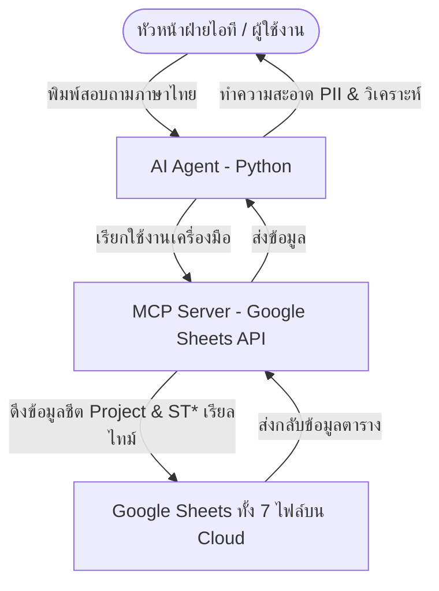

# 🚀 Excel Roadmap Chatbot Agent (Google Sheets & Drive Integration)

ผลงานส่งประกวดสำหรับโครงการ **AI Agents: Intensive Vibe Coding Capstone Project (หมวด Agents for Business)**

---

## 📌 1. ปัญหาและคุณค่าของโครงการ (Problem & Value)

ในการบริหารงานฝ่ายพัฒนาระบบสารสนเทศ (IT Development Department) ที่ต้องดูแลพนักงานพัฒนาซอฟต์แวร์ 16 คน และระบบสารสนเทศย่อยมากกว่า 30-40 ระบบ ความท้าทายหลักของผู้บริหารคือ:
* **การขาดความง่ายในการติดตามงาน (Visibility):** ข้อมูลแผนงานจะถูกจัดแบ่งออกเป็น Google Sheets แยกส่วนถึง 7 ไฟล์ตามรายทีมพัฒนา ทำให้ติดตามภาพรวมได้ยาก
* **การจัดสรรทรัพยากรบุคคล (Resource Allocation):** การตรวจสอบภาระงาน (Workload) ว่าใครกำลังทำงานอยู่ หรือใครที่คิวงานว่างชั่วคราวเป็นเรื่องยากเมื่อข้อมูลกระจัดกระจาย
* **จุดคอขวดสะสม (Bottlenecks):** งานที่ล่าช้าหรือถูกเลื่อนเนื่องจากผลกระทบภายนอก (เช่น ภัยธรรมชาติน้ำท่วมใต้กระทบกำหนดการ TCAS หรือรอกระบวนการจัดซื้อ) ตรวจพบได้ช้า

**แนวทางการแก้ไข:** พัฒนา AI Agent ที่เชื่อมโยงเข้ากับ API ของ Google Drive/Sheets ผ่าน MCP Server โดยมีระบบวิเคราะห์ระดับ Micro และ Macro คอยคัดกรองข้อมูลเฉพาะชีตรหัส **ST*** (รายละเอียดงานย่อย) และชีต **Project** (ภาพรวม) ทำให้ผู้บริหารสามารถพิมพ์สอบถามความเคลื่อนไหวผ่านแชตได้ใน 5 วินาที แทนการเปิดเว็บเบราว์เซอร์สลับไปมาถึง 7 หน้าต่าง

---

## 🏗️ 2. สถาปัตยกรรมระบบ (System Architecture)

ระบบทำงานภายใต้สถาปัตยกรรม **Model Context Protocol (MCP)** ที่ช่วยให้ LLM (Gemini) สามารถเรียกใช้เครื่องมืออ่านและเขียนไฟล์แบบ Real-time บนคลาวด์ได้อย่างปลอดภัย:



### รายละเอียดโครงสร้างข้อมูลของทั้ง 7 ทีมพัฒนา:
1. **ทีม พีท เจมส์ หวาน:** พีท, เจมส์, หวาน (รหัสโปรเจกต์หลัก: ST1, ST2)
2. **ทีม ป้อม อาร์ต นัท บี:** ป้อม, อาร์ต, นัท, บี (รหัสโปรเจกต์หลัก: ST1, ST2, ST3, ST4)
3. **ทีม เจน กิฟต์ โต้ง:** เจน, กิฟต์, โต้ง (รหัสโปรเจกต์หลัก: ST1)
4. **ทีม คิว กอล์ฟ นนท์:** คิว, กอล์ฟ, นนท์ (รหัสโปรเจกต์หลัก: ST1, ST2)
5. **ทีม แพร แบงค์ บาส:** แพร, แบงค์, บาส (มีชีตย่อยรหัส ST1, ST2)
6. **ทีม นัท จอย:** นัท, จอย (มีชีตย่อยรหัส ST3)
7. **ทีม พี่ป้อม:** พี่ป้อม, คิว, กอล์ฟ (มีชีตย่อยรหัส ST2 - ระบบบรรจุ)

---

## ⚙️ 3. คำสั่งทดสอบการวิเคราะห์หลัก (Core Test Scenarios)

AI Agent รองรับการตอบกลับคำสั่งอย่างชาญฉลาดและถูกต้องตามข้อเท็จจริงใน GSheets ผ่านการทดสอบดังนี้:
1. **ติดตามงานรายคนข้ามชีต:** *"ตอนนี้พีททำงานอะไรอยู่"* หรือ *"หวานทำงานระบบอะไรบ้างในตอนนี้"*
2. **วิเคราะห์เปอร์เซ็นต์และเดดไลน์:** *"ระบบบรรจุ ทำไปแล้วกี่เปอร์เซ็นต์ คิดว่าจะทำเสร็จทันก่อนส่งงานหรือไม่"*
3. **กรองสถานะงานเจาะจงระบบ:** *"ตอนนี้คิวกำลังพัฒนางาน (doing) อะไรในระบบบรรจุ ช่วย list มาให้หน่อย"*
4. **ค้นหาคนว่างงานข้าม 7 ชีต:** *"ตอนนี้ที่ทุกทีมมีใครบ้างที่ไม่มีสถานะงานที่เป็น doing"* (Gap Analysis)
5. **สรุปคอขวดสะสม:** *"มีระบบไหนของทีมไหนบ้างที่มีสถานะเป็น Paused หรือ Backlog และมีหมายเหตุแจ้งว่าอะไร?"*

---

## 🔒 4. มาตรฐานความปลอดภัย (Security Features)

1. **การกรองข้อมูลอ่อนไหว (PII Scrubbing):** พัฒนาโมดูล `app/security.py` เพื่อสแกนและปิดบังข้อมูลที่ระบุตัวตน เช่น อีเมลพนักงาน และเบอร์โทรศัพท์ (เช่น `user@domain.com` -> `u***@domain.com`) ก่อนที่ข้อความจะถูกส่งต่อไปยัง Gemini API
2. **Credential Protection:** เก็บค่า Google Cloud Service Account และ Gemini API Key ไว้ในระบบสภาพแวดล้อม `.env` และเพิ่มเข้าระบบ `.gitignore` ไม่ให้รั่วไหลไปสู่ GitHub สาธารณะ

---

## 💻 5. ขั้นตอนการติดตั้งและรันใช้งาน (Installation & Run)

### ความต้องการของระบบ:
* Python 3.10 ขึ้นไป

### 1. โคลนคลังรหัสและเข้าสู่ไดเรกทอรี:
```bash
git clone <repository_url>
cd excel-roadmap-agent
```

### 2. ตั้งค่าไฟล์สภาพแวดล้อม (.env):
คัดลอกไฟล์ตัวอย่างและใส่ค่ารหัส API ของคุณ:
```bash
cp .env.example .env
# เปิดไฟล์ .env และใส่ค่า GEMINI_API_KEY รวมถึงลิงก์ Google Sheets ของแต่ละทีม
```

### 3. ติดตั้ง Dependencies และรันแอปพลิเคชัน:
ติดตั้งไลบรารีทั้งหมดผ่าน pip:
```bash
pip install -r requirements.txt
# หรือหากใช้ uv:
# uv pip install -r requirements.txt
```

### 4. รัน Web Dashboard:
เปิดใช้งานแดชบอร์ดหลักด้วย Streamlit:
```bash
streamlit run main.py
```

### 5. การรันชุดทดสอบความถูกต้อง (Automated Tests):
รันระบบประเมินผลผ่าน Pytest:
```bash
pytest
```
*ระบบถูกออกแบบให้รันเทสออฟไลน์สำเร็จ 100% ผ่าน Mock Database (`database/mock_roadmap.json`) แม้ผู้ประเมินผลจะไม่ได้ตั้งค่า Google Sheets API จริง*
