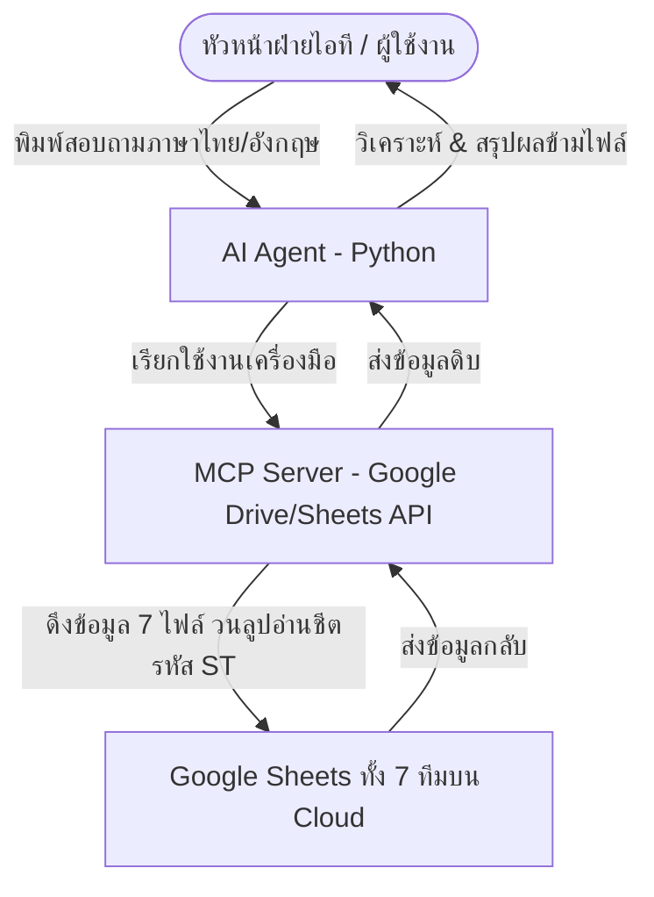

# รายละเอียดโครงการ: Excel Roadmap Chatbot Agent (เอเจนต์อัปเดตและวิเคราะห์แผนงานจาก Google Sheets)

เอกสารฉบับนี้จัดทำขึ้นเพื่ออธิบายรายละเอียด ข้อกำหนด และสถาปัตยกรรมของโครงการ **Excel Roadmap Chatbot Agent** สำหรับนำไปใช้เป็นข้อมูลประกอบการพัฒนาและส่งประกวดผลงาน Capstone Project (Kaggle / Google Agent)

---

## 1. ข้อมูลทั่วไปของโครงการ (Project Overview)

* **ชื่อโครงการ:** Excel Roadmap Chatbot Agent (เอเจนต์อัปเดตและวิเคราะห์แผนงานผ่านระบบแชต)
* **หมวดหมู่โครงการ:** เอเจนต์เพื่อธุรกิจ (Agents for Business)
* **กลุ่มเป้าหมายผู้ใช้งาน:** หัวหน้าฝ่ายพัฒนาระบบสารสนเทศ (IT Development Manager), Project Manager, Team Lead
* **บทบาทหลักของ AI Agent:** ทำหน้าที่เป็นผู้ช่วยส่วนตัวในการดึงข้อมูล วิเคราะห์ และรายงานความคืบหน้าของแผนงานพัฒนาซอฟต์แวร์จากไฟล์ Google Sheets (ที่อัปเดตแบบ Real-time โดยทีมงาน) ผ่านการพิมพ์สั่งงานด้วยภาษาธรรมชาติ (Natural Language)

---

## 2. ปัญหาและโอกาส (Problem Statement & Opportunity)

### ปัจจุบัน (As-Is):
* หัวหน้าฝ่ายไอทีต้องบริหารจัดการลูกน้องจำนวน 16 คน ซึ่งดูแลระบบสารสนเทศหลายระบบที่กระจัดกระจายกัน
* การติดตามความคืบหน้าของแต่ละโครงการต้องทำโดยการเปิดไฟล์ Excel/Google Sheets แผนงานขนาดใหญ่และไล่ดูทีละแถว ซึ่งใช้เวลามากและยากต่อการมองเห็นภาพรวม (Visibility)
* เกิดความล่าช้าในการตรวจพบจุดคอขวด (Bottlenecks) หรือทีมงานที่มีภาระงานล้นมือ (Workload Overload)

### สิ่งที่จะพัฒนา (To-Be):
* พัฒนา AI Agent ที่เชื่อมต่อกับไฟล์แผนงานบน Google Drive/Sheets โดยตรงผ่าน **MCP Server (Model Context Protocol)**
* หัวหน้าทีมสามารถพิมพ์ถามสรุปภาพรวม ติดตามสถานะ หรือวิเคราะห์ความเสี่ยงผ่านแชตได้ทันที
* ข้อมูลมีความเป็นปัจจุบัน (Real-time) และยังรักษาความปลอดภัยของข้อมูลองค์กรตามมาตรฐาน

---

## 3. วัตถุประสงค์ (Objectives)

1. เพื่อสร้าง AI Agent ที่ช่วยเพิ่มประสิทธิภาพในการติดตามงาน (Project Tracking Visibility) ของหัวหน้าทีมไอที
2. เพื่อนำแนวคิด **MCP (Model Context Protocol)** มาประยุกต์ใช้ในการเชื่อมต่อ AI เข้ากับแหล่งข้อมูลภายนอก (Google Sheets API) ได้อย่างถูกต้องและปลอดภัย
3. เพื่อลดเวลาในการประชุมสรุปงานรายสัปดาห์ (Weekly Standup) และช่วยในการกระจายภาระงานในทีมได้อย่างสมดุล (Resource Allocation)

---

## 4. สถาปัตยกรรมระบบและโครงสร้างข้อมูล (System Architecture & Data Structure)

ระบบถูกออกแบบภายใต้สถาปัตยกรรมที่เรียบง่ายแต่ทรงพลัง (Vibe Coding Style) โดยเชื่อมต่อผ่านไฟล์ Google Sheets ทั้งสิ้น **7 ไฟล์ (แยกตามทีม)** บน Google Drive เป็นฐานข้อมูลหลัก เพื่อลดความซับซ้อนในการจัดการ Database:

### รายละเอียดโครงสร้างข้อมูลและทีมงาน (ทั้ง 7 ทีม):
ตารางแผนงานจะถูกจัดแบ่งเป็น 7 ไฟล์ของ 7 ทีมพัฒนาระบบ ได้แก่:
1. **ทีม พีท เจมส์ หวาน (3 คน):** พีท, เจมส์, หวาน
2. **ทีม ป้อม อาร์ต นัท บี (4 คน):** ป้อม, อาร์ต, นัท, บี
3. **ทีม เจน กิฟต์ โต้ง (3 คน):** เจน, กิฟต์, โต้ง
4. **ทีม คิว กอล์ฟ นนท์ (3 คน):** คิว, กอล์ฟ, นนท์
5. **ทีม แพร แบงค์ บาส (3 คน):** แพร, แบงค์, บาส
6. **ทีม นัท จอย (2 คน):** นัท, จอย
7. **ทีม พี่ป้อม (3 คน):** พี่ป้อม, คิว, กอล์ฟ

### โครงสร้างชีตย่อยในแต่ละไฟล์ Excel/Sheets:
* **ระบบการจัดเก็บข้อมูลย่อย (Worksheet Filter):** ในแต่ละไฟล์จะมีชีตย่อยหลายชีต โดยชีตที่มีชื่อ**ขึ้นต้นด้วยรหัส "ST" และมีตัวเลขต่อท้าย** (เช่น `ST1`, `ST2`, `ST3`) จะหมายถึงแผนงานและรายละเอียดงานย่อย (Tasks) ที่ต้องทำของระบบนั้นๆ
* **การคัดกรองข้อมูลของ Agent:** AI Agent จะใช้ฟังก์ชันสแกนและดึงข้อมูลเฉพาะชีตที่ขึ้นต้นด้วย "ST" เท่านั้นเพื่อประหยัดพลังงาน (Token) และข้ามชีตสรุปอื่นๆ ที่ไม่เกี่ยวข้อง
* **ฟิลด์ข้อมูลสำคัญในชีต ST:**
  * `ระบบ` (System Name)
  * `งานย่อย/กิจกรรม` (Sub-task / Activity Name)
  * `ผู้รับผิดชอบ` (Developer Name)
  * `เปอร์เซ็นต์ความคืบหน้า` (% Progress)
  * `สถานะ` (Status: Doing, Done, Backlog, Paused)
  * `หมายเหตุสำคัญ` (Remarks: ปัญหาอุปสรรค, ผลกระทบจากภายนอก)

* **ในทุกทีม ในไฟล์ Google Sheet Excel จะมีหลาย sheet ซึ่งมี sheet ดังนี้ 
	1. **sheet ที่ชื่อ "Project"** คือ รวมทุกระบบของทีม ซึ่ง คำอธิบายของแต่ละคอลัมน์จะอยู่ที่แถวแรก และแต่ละคอลัมน์ คือ
		1. **B จะมีรหัสของ Project อยู่** เช่น ST1, ST2, ST3 ไปเรื่อย 
		2. **C คือชื่อระบบ**
		3. **E คือ หัวหน้าทีม**   
		4. **F ผู้ร่วมทีม**
		5. **H วันที่เริ่มต้น**
		6. **I วันที่สิ้นสุด**
		7. **J กำหนดส่งงาน**
		8. **K สถานะของ Project**
		9. **L จำนวนงานที่เสร็จแล้ว Done**
		10. **M จำนวนงานทั้งหมด**
		11. **N เปอร์เซ็นต์ความคืบหน้าของ Project**
		12. **P หมายเหต ุ**
	2. **sheet ที่มีคำว่า ST เป็นคำขึ้นต้น และต่อท้ายด้วยเลข เช่น ST1, ST2, ST3** เป็นรายละเอียดงานของแต่ละ Project ว่า Project นั้นทำอะไรบ้าง สถานะของแต่ละงานเป็นอย่างไร ใครเป็นผู้รับผิดชอบ สถานะ (To Do / Doing / Done)

---

## 5. ฟังก์ชันการทำงานและสถานการณ์ใช้งานจริง (Core Features & Scenarios)

AI Agent จะต้องรองรับการตอบคำถามในภาษาไทยทั่วไป และประมวลผลข้อมูลข้ามชีต ST ทั้ง 7 ไฟล์ โดยผ่านการทดสอบตามสถานการณ์จำลองดังต่อไปนี้:

| ฟังก์ชันการทำงาน                                                                | คำอธิบายและคำถามตัวอย่าง                                                                                                                                                                                                                                                                                                                                                       |
| :------------------------------------------------------------------------------ | :----------------------------------------------------------------------------------------------------------------------------------------------------------------------------------------------------------------------------------------------------------------------------------------------------------------------------------------------------------------------------- |
| **1. ติดตามงานย่อยของรายบุคคล**  (Developer Task Tracking)                   | ค้นหางานย่อยทั้งหมดที่โปรแกรมเมอร์คนนั้นต้องทำจากทุกชีตรหัส ST ของทุกทีม  _**ตัวอย่างการสั่ง:**_ *"ตอนนี้พีททำงานอะไรอยู่"* หรือ *"หวานทำงานระบบอะไรบ้างในตอนนี้"*  _**การตอบกลับของ AI:**_ ดึงลิสต์งานย่อยของพีท/หวานจากชีต ST ของทุกทีมมารายงานแยกเป็นรายโครงการพร้อมสถานะการทำงาน                                                                                     |
| **2. คำนวณความคืบหน้าและประเมินเดดไลน์**  (Progress & Deadline Risk Audit)   | คำนวณค่าเฉลี่ยความคืบหน้าและวิเคราะห์แนวโน้มความเสี่ยงในการส่งมอบระบบ  _**ตัวอย่างการสั่ง:**_ *"ระบบบรรจุ ทำไปแล้วกี่เปอร์เซ็นต์ คิดว่าจะทำเสร็จทันก่อนส่งงานหรือไม่"*  _**การตอบกลับของ AI:**_ ตรวจสอบชีต **ST02 (ระบบบรรจุ)** ของ **ทีม พี่ป้อม** คำนวณเปอร์เซ็นต์ความคืบหน้า (เช่น 75%) และประเมินความเสี่ยงร่วมกับหมายเหตุสำคัญเพื่อระบุว่าจะส่งมอบทันหรือไม่ |
| **3. ดึงงานย่อยที่มีสถานะเฉพาะเจาะจง**  (Specific Status Filter)             | กรองงานย่อยของพนักงานในโครงการที่กำลังดำเนินงานอยู่ (`doing`) เท่านั้น  _**ตัวอย่างการสั่ง:**_ *"ตอนนี้คิวกำลังพัฒนางาน (doing) อะไรในระบบบรรจุ ช่วย list มาให้หน่อย"*  _**การตอบกลับของ AI:**_ เข้าไปอ่านชีตระบบบรรจุ คัดกรองและแสดงผลงานที่เป็นของ คิว และมีสถานะเท่ากับ `doing` เท่านั้น                                                                              |
| **4. ค้นหาคนว่างหรือผู้ที่ไม่มีภาระงาน**  (Resource Allocation & Idle Check) | ทำการหาพนักงานทั้งหมด 16 คนที่ไม่มีงานใดๆ ในสถานะกำลังทำอยู่ (`doing`) เลยในรอบสัปดาห์นี้  _**ตัวอย่างการสั่ง:**_ *"ตอนนี้ที่ทุกทีมมีใครบ้างที่ไม่มีสถานะงานที่เป็น doing"*  _**การตอบกลับของ AI:**_ ทำการตรวจข้อมูลพนักงานทั้งหมดในทุกชีต ST หากใครไม่มีงานชิ้นใดที่ติดสถานะกำลังทำอยู่ (`doing`) เลย จะระบุรายชื่อออกมาเพื่อให้หัวหน้าดึงตัวมาทำงานด่วนได้             |
| **5. วิเคราะห์ปัญหาคอขวดเชิงลึก**  (Bottleneck & Paused Analysis)            | ค้นหางานย่อยในทุกชีตของทุกทีมที่มีการบันทึกหมายเหตุว่า "ติดปัญหา" หรือ "รออนุมัติ" หรือมีสถานะ "Paused" หรือ "Backlog"  _**ตัวอย่างการสั่ง:**_ *"มีระบบไหนของทีมไหนบ้างที่มีสถานะเป็น Paused หรือ Backlog และมีหมายเหตุแจ้งว่าอะไร?"*                                                                                                                                       |
| **6. อัปเดตสถานะกลับไปยัง Sheets**  (Write-back Data)                        | บันทึกการแก้ไขสถานะในชีตย่อยแบบ Real-time  _**ตัวอย่างการสั่ง:**_ *"เปลี่ยนสถานะของระบบ B เป็น 'เสร็จสิ้น (Completed)' ให้ที"*                                                                                                                                                                                                                                              |

---

## 6. เทคโนโลยีที่เลือกใช้ (Technology Stack)

* **Language:** Python 3.10+
* **LLM Model:** Gemini 1.5 Pro / Flash (ผ่านทาง API)
* **Integration Framework:** MCP (Model Context Protocol) Server SDK
* **Libraries:**
  * `google-api-python-client` / `google-auth-oauthlib` (สำหรับเชื่อมต่อ Google Sheets/Drive API)
  * `dotenv` (สำหรับดึงค่า API Credentials จาก `.env` เพื่อความปลอดภัย)
  * `pandas` / `openpyxl` (สำหรับวิเคราะห์จัดการข้อมูลในกรณีดาวน์โหลดมาประมวลผล)

---

## 7. แผนการทดสอบและเกณฑ์ความปลอดภัย (Security & Verification Plan)

### มาตรการความปลอดภัย (Security):
* **ห้ามบันทึก API Keys หรือ OAuth Client ID/Secret ลงใน Git:** ข้อมูลสิทธิ์ทั้งหมดต้องเก็บในไฟล์ `.env` ที่ไม่อัปโหลดขึ้น GitHub Repository
* **สิทธิ์การเข้าถึงข้อมูล (OAuth Scope):** ใช้การลงทะเบียนสิทธิ์แบบจำกัดเฉพาะไฟล์แผนงานที่ต้องการ (Scoped Access) หรือเข้าถึงเฉพาะโฟลเดอร์โครงการบน Drive เท่านั้น

### วิธีการทดสอบระบบ (Manual Verification):
1. **ทดสอบการอ่านข้อมูลสด (Real-time Fetching):** ทำการแก้ไขสถานะใน Google Sheets จากเบราว์เซอร์ จากนั้นพิมพ์ถาม AI Agent ทันทีเพื่อตรวจสอบว่าดึงข้อมูลล่าสุดมาตอบหรือไม่
2. **ทดสอบวิเคราะห์ตรรกะซับซ้อน (Logic Check):** ป้อนสถานะที่ขัดแย้งกัน (เช่น วันกำหนดส่งผ่านไปแล้วแต่สถานะยังเป็น 'ไม่เริ่มทำ') เพื่อดูว่า AI สามารถตรวจจับและแจ้งเตือนความเสี่ยง (Risk Alert) ได้อย่างถูกต้องหรือไม่
